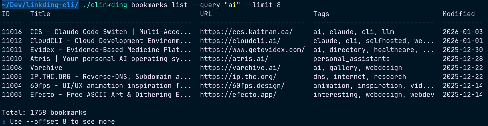

# clinkding

> A modern, feature-complete CLI for [linkding](https://github.com/sissbruecker/linkding) bookmark manager

[](LICENSE)
[](go.mod)

**clinkding** is a command-line interface for managing your linkding bookmarks. Built with Go for speed and ease of distribution, it provides full API coverage with a human-friendly interface that's also perfect for scripting.



## Features

✨ **Full API Coverage**
- 📑 Bookmarks (create, read, update, delete, archive, search)
- 🏷️ Tags (list, create, get)
- 📦 Bundles (full CRUD operations)
- 📎 Assets (upload, download, manage file attachments)
- 👤 User profile

🎨 **Modern CLI Experience**
- Human-friendly output with colors and tables
- Machine-readable JSON and plain text modes
- Smart configuration (flags, environment variables, config file)
- Interactive confirmations for destructive operations
- Progress indicators for long operations

⚡ **Developer Friendly**
- Single binary, no dependencies
- Cross-platform (macOS, Linux, Windows)
- Shell completion (bash, zsh, fish)
- Scriptable with stable exit codes

## Installation

### macOS (Homebrew)

```bash
brew install daveonkels/tap/clinkding
```

### Binary Download

Download the latest release for your platform from the [releases page](https://github.com/daveonkels/clinkding/releases).

### From Source

```bash
go install github.com/daveonkels/clinkding@latest
```

## Quick Start

### 1. Configure

```bash
# Interactive setup
clinkding config init

# Or use flags
clinkding --url https://linkding.example.com --token YOUR_TOKEN bookmarks list
```

### 2. Manage Bookmarks

```bash
# List bookmarks
clinkding bookmarks list

# Search bookmarks
clinkding bookmarks list --query "golang tutorial"

# Create a bookmark
clinkding bookmarks create https://go.dev \
  --title "Go Programming Language" \
  --tags "golang,programming,reference" \
  --description "Official Go website"

# Update a bookmark
clinkding bookmarks update 42 \
  --add-tags "learning,docs" \
  --description "Updated description"

# Archive a bookmark
clinkding bookmarks archive 42

# Delete a bookmark
clinkding bookmarks delete 42
```

### 3. Work with Tags

```bash
# List all tags
clinkding tags list

# Create a tag
clinkding tags create "golang"

# Get tag details
clinkding tags get 1
```

### 4. Manage Bundles

```bash
# List bundles
clinkding bundles list

# Create a bundle
clinkding bundles create "Go Resources" \
  --description "Everything related to Go programming"

# Update a bundle
clinkding bundles update 1 --name "Go Lang Resources"

# Delete a bundle
clinkding bundles delete 1
```

### 5. Handle Assets

```bash
# List assets for a bookmark
clinkding assets list 42

# Upload a file
clinkding assets upload 42 ~/Documents/screenshot.png

# Download an asset
clinkding assets download 42 1 -o ./downloaded-file.png

# Delete an asset
clinkding assets delete 42 1
```

## Configuration

### Configuration File

By default, clinkding looks for a config file at `~/.config/clinkding/config.yaml`:

```yaml
url: https://linkding.example.com
token: your-api-token-here

defaults:
  bookmark_limit: 100
  output_format: auto  # auto, json, plain
```

### Environment Variables

```bash
export LINKDING_URL="https://linkding.example.com"
export LINKDING_TOKEN="your-api-token-here"
```

### Precedence

Configuration is applied in this order (highest to lowest):
1. Command-line flags (`--url`, `--token`)
2. Environment variables (`LINKDING_URL`, `LINKDING_TOKEN`)
3. Config file (`~/.config/clinkding/config.yaml`)

## Advanced Usage

### JSON Output for Scripts

```bash
# Export all bookmarks as JSON
clinkding bookmarks list --json > bookmarks.json

# Get specific bookmark in JSON
clinkding bookmarks get 42 --json | jq '.title'
```

### Plain Text for Parsing

```bash
# Get tab-separated values
clinkding bookmarks list --plain | cut -f1,3

# Archive old bookmarks
clinkding bookmarks list --modified-since "180d" --plain | \
  while read id _; do
    clinkding bookmarks archive "$id"
  done
```

### Relative Date Filtering

```bash
# Bookmarks modified in the last 7 days
clinkding bookmarks list --modified-since "7d"

# Bookmarks added in the last 24 hours
clinkding bookmarks list --added-since "24h"

# Supports: h (hours), d (days), y (years)
```

### Check Before Creating

```bash
# Check if URL already exists
clinkding bookmarks check https://go.dev
```

### Batch Operations

```bash
# Tag multiple bookmarks
for id in 42 43 44; do
  clinkding bookmarks update $id --add-tags "important"
done

# Export bookmarks with specific tag
clinkding bookmarks list --query "tag:golang" --json | \
  jq -r '.results[] | .url' > golang-bookmarks.txt
```

## Global Flags

All commands support these global flags:

| Flag | Description |
|------|-------------|
| `-h, --help` | Show help |
| `--version` | Show version |
| `-c, --config <file>` | Config file path |
| `-u, --url <url>` | Linkding instance URL |
| `-t, --token <token>` | API token |
| `--json` | Output as JSON |
| `--plain` | Output as plain text |
| `--no-color` | Disable colors |
| `-q, --quiet` | Minimal output |
| `-v, --verbose` | Verbose output |

## Shell Completion

### Bash

```bash
clinkding completion bash > /etc/bash_completion.d/clinkding
```

### Zsh

```bash
clinkding completion zsh > "${fpath[1]}/_clinkding"
```

### Fish

```bash
clinkding completion fish > ~/.config/fish/completions/clinkding.fish
```

## Exit Codes

| Code | Meaning |
|------|---------|
| 0 | Success |
| 1 | General error (API error, network error) |
| 2 | Invalid usage (bad flags, missing args) |
| 3 | Authentication error (invalid token) |
| 4 | Not found (resource doesn't exist) |
| 130 | Interrupted (Ctrl-C) |

## Examples

### Daily Workflow

```bash
# Morning: Check unread bookmarks
clinkding bookmarks list --query "unread:yes"

# Add a bookmark from clipboard
pbpaste | xargs -I {} clinkding bookmarks create {}

# Quick search
clinkding bookmarks list --query "golang"

# Archive old unread bookmarks
clinkding bookmarks list --query "unread:yes" --added-since "30d" --plain | \
  while read id _; do
    clinkding bookmarks archive "$id"
  done
```

### Backup & Restore

```bash
# Backup all bookmarks
clinkding bookmarks list --json > backup-$(date +%Y%m%d).json

# Export specific tag
clinkding bookmarks list --query "tag:important" --json > important.json
```

### Integration with Other Tools

```bash
# Open random bookmark in browser
clinkding bookmarks list --plain | shuf -n1 | cut -f3 | xargs open

# Add bookmark with fzf selection
clinkding tags list --plain | fzf | cut -f2 | \
  xargs -I {} clinkding bookmarks create "$URL" --tags {}

# Sync to Pocket (example)
clinkding bookmarks list --json | jq -r '.results[].url' | \
  while read url; do pocket add "$url"; done
```

## Development

### Building from Source

```bash
git clone https://github.com/daveonkels/clinkding.git
cd clinkding
go build -o clinkding .
```

### Running Tests

```bash
go test ./...
```

### Project Structure

```
clinkding/
├── cmd/              # Command implementations
│   ├── assets/       # Asset commands
│   ├── bookmarks/    # Bookmark commands
│   ├── bundles/      # Bundle commands
│   ├── config/       # Config commands
│   ├── tags/         # Tag commands
│   └── user/         # User commands
├── internal/
│   ├── api/          # API client methods
│   ├── client/       # HTTP client
│   ├── config/       # Configuration management
│   ├── models/       # Data models
│   └── output/       # Output formatters
└── main.go           # Entry point
```

## Troubleshooting

### Connection Issues

```bash
# Test your connection
clinkding config test

# Check configuration
clinkding config show
```

### Authentication Errors

1. Verify your API token in the linkding web interface
2. Ensure the URL includes the protocol (`https://`)
3. Check for trailing slashes in the URL

### Getting Help

```bash
# Command-specific help
clinkding bookmarks --help
clinkding bookmarks create --help

# General help
clinkding --help
```

## Contributing

Contributions are welcome! Please feel free to submit a Pull Request.

1. Fork the repository
2. Create your feature branch (`git checkout -b feature/amazing-feature`)
3. Commit your changes (`git commit -m 'Add amazing feature'`)
4. Push to the branch (`git push origin feature/amazing-feature`)
5. Open a Pull Request

## License

MIT License - see [LICENSE](LICENSE) for details.

## Acknowledgments

- [linkding](https://github.com/sissbruecker/linkding) - The excellent bookmark manager this CLI is built for
- [Cobra](https://github.com/spf13/cobra) - CLI framework
- [Viper](https://github.com/spf13/viper) - Configuration management

## Related Projects

- [linkding](https://github.com/sissbruecker/linkding) - The linkding bookmark manager
- [linkding-cli](https://github.com/bachya/linkding-cli) - Original Python-based CLI (inspiration for this project)

---

Made with ❤️ for the linkding community
